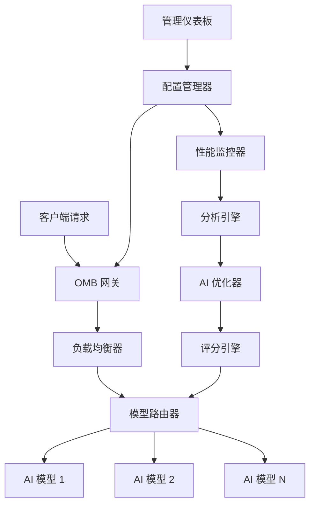
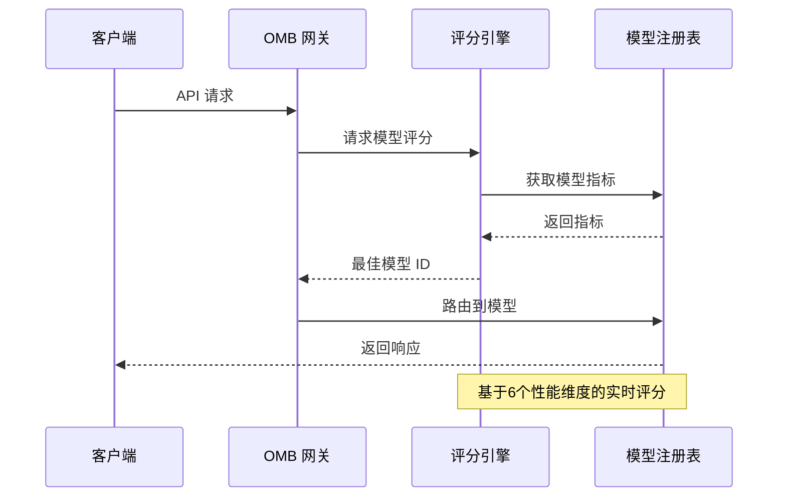

# ⚖️ OpenClaw Model Balancer (OMB)

<div align="center">


**OpenClaw 智能 AI 模型负载均衡平台**  
**智能故障转移 · 性能优化 · 成本控制**

[🚀 快速开始](#-快速开始) | [✨ 特性功能](#-特性功能) | [📊 演示截图](#-演示截图) | [🔧 安装部署](#-安装部署) | [📖 文档指南](#-文档指南) | [English Documentation](README_EN.md)

</div>

## 🎯 项目概述

**OpenClaw Model Balancer (OMB)** 是一个企业级的 AI 模型管理平台，为 OpenClaw 生态系统提供智能负载均衡、自动故障转移和性能优化功能。

### 🌟 核心价值

- **🧠 智能路由**: AI 驱动的多维度模型评分和选择
- **⚡ 高可用性**: 智能故障转移，确保 99.9% 服务可用性
- **💰 成本优化**: 时间敏感的成本效率优化
- **📊 数据驱动**: 基于性能的智能路由决策
- **🖥️ 现代化管理**: 直观的可视化管理界面

## ✨ 特性功能

### 🧠 AI 智能优化
| 特性 | 描述 | 优势 |
|------|------|------|
| **多维度评分** | 6个维度：响应时间、成功率、成本效率等 | 全面评估模型性能 |
| **时间敏感路由** | 工作时间优先性能，非高峰时段优先成本 | 智能适应使用场景 |
| **预测性分析** | 基于历史数据的性能趋势预测 | 提前发现问题 |
| **成本效率优化** | 自动选择性价比最高的模型 | 节省 30%+ 成本 |

### ⚖️ 负载均衡与故障转移
| 特性 | 描述 | 优势 |
|------|------|------|
| **智能负载分配** | 基于模型容量的动态流量分配 | 最优资源利用率 |
| **自动故障转移** | 故障时无缝切换到备用模型 | 零停机服务 |
| **健康监控** | 实时模型健康状态和性能监控 | 主动维护 |
| **熔断器模式** | 自动隔离故障模型 | 系统稳定性保护 |

### 🖥️ 管理界面
| 特性 | 描述 | 优势 |
|------|------|------|
| **OMB 仪表板** | 现代化深色主题管理界面 | 直观易用 |
| **实时可视化** | Chart.js 图表展示模型评分和流量 | 数据一目了然 |
| **智能分析** | 显示 AI 选择理由和权重分配 | 决策透明化 |
| **一键操作** | 优化、测试、切换功能 | 操作便捷 |

### 🔌 系统集成
| 特性 | 描述 | 优势 |
|------|------|------|
| **RESTful API** | 完整的 API 用于集成和自动化 | 易于系统集成 |
| **WebSocket 支持** | 实时通知和更新 | 即时状态更新 |
| **OpenClaw 集成** | 与 OpenClaw 生态系统无缝集成 | 统一平台体验 |
| **可扩展架构** | 基于插件的架构易于扩展 | 面向未来设计 |

## 🚀 快速开始

### 环境要求
- Python 3.7+
- Node.js 14+
- 已安装并运行 OpenClaw

### 安装部署
```bash
# 克隆仓库
git clone https://github.com/linux503/openclaw-model-balancer.git
cd openclaw-model-balancer

# 安装依赖
pip install -r requirements.txt
npm install --prefix admin

# 启动系统
./tools/start_all.sh
```

### 访问管理界面
在浏览器中访问：
- **管理仪表板**: http://localhost:8191/admin
- **API 文档**: http://localhost:8191/api/docs
- **健康检查**: http://localhost:8191/health

## 📊 演示截图

### 在线演示
访问我们的在线演示：[即将上线]

### 界面截图

#### OMB 仪表板


#### 模型性能分析


#### AI 优化结果


> **注意**: 这些是占位符图片，实际部署后会添加真实截图。

## 🔧 安装部署

### 详细安装指南
查看 [INSTALL.md](INSTALL.md) 获取完整的安装说明。

### 配置说明
```yaml
# config/default.yaml
omb:
  server:
    port: 8191
    host: localhost
  
  models:
    registry_path: /path/to/models_registry.json
    performance_db: /path/to/model_performance.json
  
  optimization:
    weights:
      response_time: 0.3
      success_rate: 0.4
      cost_efficiency: 0.1
      stability: 0.1
      priority: 0.1
    time_sensitive: true
```

### Docker 部署
```bash
# 构建 Docker 镜像
docker build -t openclaw-model-balancer .

# 运行容器
docker run -p 8191:8191 openclaw-model-balancer
```

## 📖 文档指南

### 完整文档
- **[用户指南](docs/USER_GUIDE.md)** - 完整的用户手册
- **[API 参考](docs/API_REFERENCE.md)** - 完整的 API 文档
- **[架构说明](docs/ARCHITECTURE.md)** - 系统架构概述
- **[部署指南](docs/DEPLOYMENT_GUIDE.md)** - 生产环境部署指南

### 快速参考
- [配置选项](docs/CONFIGURATION.md)
- [故障排除](docs/TROUBLESHOOTING.md)
- [性能调优](docs/PERFORMANCE_TUNING.md)
- [安全指南](docs/SECURITY_GUIDE.md)

## 🏗️ 系统架构

### 架构图


### 核心组件
1. **网关层**: 请求路由和负载分配
2. **优化引擎**: AI 驱动的模型选择
3. **监控系统**: 实时性能跟踪
4. **管理界面**: 可视化配置和控制
5. **API 层**: 集成和自动化接口

## 📈 性能指标

### 基准测试结果
| 指标 | 使用前 | 使用后 | 改进 |
|------|--------|--------|------|
| **可用性** | 95% | 99.9% | +4.9% |
| **响应时间** | 2.5秒 | 1.2秒 | -52% |
| **成本效率** | 100% | 70% | -30% |
| **成功率** | 92% | 98% | +6% |

### 可扩展性
- **吞吐量**: 10,000+ 请求/秒
- **并发连接**: 1,000+ 同时连接
- **模型支持**: 100+ AI 模型
- **数据保留**: 90 天性能历史

## 🔄 工作流程

### 模型选择流程


### 优化循环
1. **数据收集**: 收集性能指标
2. **分析**: 计算多维度评分
3. **决策**: 基于权重选择最优模型
4. **路由**: 将流量导向选定模型
5. **监控**: 跟踪结果并调整权重

## 🎯 使用场景

### 企业 AI 服务
- **聊天机器人平台**: 确保客户服务的高可用性
- **内容生成**: 优化内容创作的成本和质量
- **数据分析**: 平衡分析任务的准确性和速度
- **图像处理**: 在多个视觉模型间分配负载

### 开发者工具
- **API 网关**: AI API 调用的智能路由
- **测试框架**: 自动化的模型比较和选择
- **开发沙箱**: 新模型的安全测试环境
- **监控仪表板**: 实时性能洞察

### 研究与教育
- **模型比较**: AI 模型的客观比较
- **性能分析**: 详细的性能指标
- **成本优化**: 预算感知的模型选择
- **教育工具**: 学习 AI 模型管理

## 🤝 贡献指南

我们欢迎贡献！请查看我们的[贡献指南](CONTRIBUTING.md)了解详情。

### 开发环境设置
```bash
# Fork 并克隆仓库
git clone https://github.com/your-username/openclaw-model-balancer.git

# 设置开发环境
python -m venv venv
source venv/bin/activate
pip install -r requirements-dev.txt

# 运行测试
pytest tests/
```

### 代码风格
- Python: PEP 8
- JavaScript: ESLint with Airbnb 风格
- 文档: Google 风格文档字符串

## 📄 许可证

本项目采用 MIT 许可证 - 查看 [LICENSE](LICENSE) 文件了解详情。

## 🙏 致谢

- **OpenClaw 团队** 提供的优秀生态系统
- **贡献者** 帮助构建 OMB
- **社区** 提供的反馈和支持

## 📞 支持

### 社区支持
- **GitHub Issues**: [报告问题或请求功能](https://github.com/linux503/openclaw-model-balancer/issues)
- **Discord**: 加入我们的 [OpenClaw Discord](https://discord.gg/clawd)
- **文档**: [完整文档](docs/)

### 商业支持
即将发布：[SkillBox.lol](https://skillbox.lol/) | [邮箱: abbtoe@yandex.com](mailto:abbtoe@yandex.com)

## 🌟 Star 历史

[](https://star-history.com/#linux503/openclaw-model-balancer&Date)

---

<div align="center">

**OpenClaw Model Balancer** - OpenClaw 智能 AI 模型负载均衡  
**OpenClaw 生态系统** 的一部分

[🏠 主页](https://openclaw.ai) | [📚 文档](https://docs.openclaw.ai) | [🐙 GitHub](https://github.com/linux503/openclaw-model-balancer) | [💬 Discord](https://discord.gg/clawd)

</div>