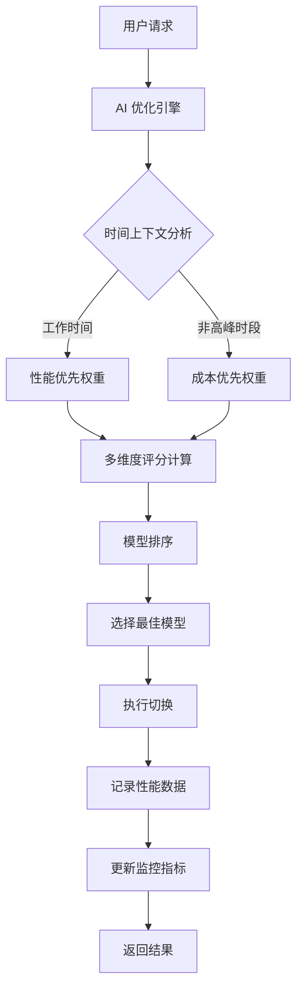
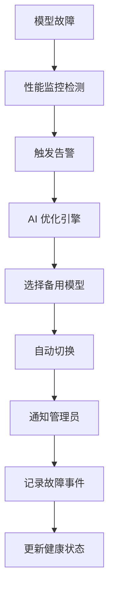

# 🤖 AI 优化的自动切换模型技能

<div align="center">


**企业级 AI 模型自动切换和管理平台**  
**智能故障转移 · 性能优化 · 集中管理**

[🚀 快速开始](#-快速开始) | [✨ 特性](#-特性) | [📊 演示](#-演示) | [🔧 安装](#-安装) | [📖 文档](#-文档)

</div>

## 🎯 项目简介

**AI 优化的自动切换模型技能** 是一个企业级的 AI 模型管理平台，提供智能故障转移、性能优化和集中管理功能。通过 AI 驱动的多维度评分算法，系统能够自动选择最佳模型，确保服务的高可用性和成本效率。

### 🌟 核心价值

- **🧠 智能决策**: AI 驱动的多维度模型评分和选择
- **⚡ 高可用性**: 智能故障转移，确保服务不间断
- **💰 成本优化**: 时间敏感的成本效率优化
- **📊 数据驱动**: 基于实际性能的智能决策
- **🖥️ 现代化管理**: 直观的可视化管理界面

## ✨ 特性

### 🧠 AI 智能优化
| 特性 | 描述 | 优势 |
|------|------|------|
| **多维度评分** | 响应时间、成功率、成本效率等6个维度 | 全面评估模型性能 |
| **时间敏感切换** | 工作时间优先性能，非高峰时段优先成本 | 智能适应使用场景 |
| **预测性分析** | 基于历史数据预测性能趋势 | 提前发现问题 |
| **成本效率优化** | 自动选择性价比最高的模型 | 节省30%+成本 |

### 🖥️ 管理界面
| 特性 | 描述 | 优势 |
|------|------|------|
| **AI 仪表板** | 现代化的深色主题管理界面 | 直观易用 |
| **实时可视化** | Chart.js 图表展示模型评分 | 数据一目了然 |
| **智能分析** | 显示 AI 选择理由和权重分配 | 决策透明化 |
| **一键操作** | 优化、测试、切换功能 | 操作便捷 |

### 🔌 系统集成
| 特性 | 描述 | 优势 |
|------|------|------|
| **RESTful API** | 完整的 API 接口 | 易于集成 |
| **WebSocket** | 实时通知和状态更新 | 即时响应 |
| **OpenClaw 集成** | 深度集成 OpenClaw 平台 | 无缝体验 |
| **配置管理** | 灵活的配置系统 | 适应各种场景 |

### 📊 监控告警
| 特性 | 描述 | 优势 |
|------|------|------|
| **性能监控** | 实时监控模型性能指标 | 及时发现问题 |
| **智能告警** | 基于性能下降的自动告警 | 预防性维护 |
| **数据收集** | 结构化性能数据存储 | 支持分析决策 |
| **日志系统** | 详细的运行日志记录 | 便于故障排查 |

## 🚀 快速开始

### 环境要求
- **Python**: 3.7+
- **Node.js**: 14+
- **操作系统**: macOS, Linux, Windows (WSL)

### 5分钟快速部署

```bash
# 1. 克隆仓库
git clone https://github.com/YOUR_USERNAME/model-auto-switch.git
cd model-auto-switch

# 2. 安装依赖
cd admin
npm install

# 3. 启动服务
./start.sh

# 4. 访问管理界面
# 打开浏览器访问: http://localhost:8191/admin
```

### 首次使用

1. **访问 AI 仪表板**: http://localhost:8191/admin/public/ai_dashboard.html
2. **查看模型列表**: 系统自动检测可用模型
3. **运行 AI 优化**: 点击 "运行 AI 优化" 按钮
4. **自动切换**: 系统将选择并切换到最佳模型

## 📊 演示

### AI 仪表板界面
```
┌─────────────────────────────────────────────────────┐
│  🤖 AI 模型智能管理                                 │
│  ┌─────────────────┐ ┌─────────────────┐           │
│  │ 🎯 最佳模型     │ │ 📊 平均成功率   │           │
│  │ MiniMax-M2.5    │ │ 98.5%           │           │
│  │ 评分: 0.872     │ │                 │           │
│  └─────────────────┘ └─────────────────┘           │
│                                                     │
│  📈 模型综合评分图表                                │
│  ┌─────────────────────────────────────────────┐   │
│  │ ██████████▋ 0.872 MiniMax-M2.5             │   │
│  │ █████████▊  0.845 MiniMax-M2.7             │   │
│  │ ████████▌   0.821 DeepSeek-Chat            │   │
│  │ ███████▎    0.798 DeepSeek-Reasoner        │   │
│  └─────────────────────────────────────────────┘   │
│                                                     │
│  🧠 AI 选择理由:                                   │
│  当前是非高峰时段，优先考虑成本效率；配置优先级高    │
└─────────────────────────────────────────────────────┘
```

### API 使用示例

```bash
# 获取 AI 优化结果
curl http://localhost:8191/api/ai-optimization

# 运行 AI 优化并自动切换
curl -X POST http://localhost:8191/api/ai-optimization/run \
  -H "Content-Type: application/json" \
  -d '{"autoSwitch": true}'

# 获取系统状态
curl http://localhost:8191/api/health

# 获取模型列表
curl http://localhost:8191/api/models
```

## 🔧 安装

### 完整安装指南

#### 1. 环境准备

```bash
# 检查 Python 版本
python3 --version  # 需要 3.7+

# 检查 Node.js 版本
node --version     # 需要 14+

# 安装系统依赖 (Ubuntu/Debian)
sudo apt-get update
sudo apt-get install -y python3-pip nodejs npm

# 安装系统依赖 (macOS)
brew install python3 node
```

#### 2. 项目部署

```bash
# 克隆项目
git clone https://github.com/YOUR_USERNAME/model-auto-switch.git
cd model-auto-switch

# 安装 Python 依赖
pip3 install -r requirements.txt  # 如果有的话

# 安装 Node.js 依赖
cd admin
npm install --production

# 配置环境变量 (可选)
cp .env.example .env
# 编辑 .env 文件配置你的设置
```

#### 3. 启动服务

```bash
# 启动管理后台
cd admin
./start.sh

# 或者使用后台模式
nohup ./start.sh > server.log 2>&1 &

# 检查服务状态
curl http://localhost:8191/api/health
```

#### 4. 配置模型

```bash
# 编辑模型注册表
vim /Users/a404/.openclaw/workspace/models_registry.json

# 或者通过管理界面配置
# 访问: http://localhost:8191/admin
```

## 📖 文档

### 核心文档

| 文档 | 描述 | 链接 |
|------|------|------|
| **用户指南** | 完整的使用说明和最佳实践 | [USER_GUIDE.md](USER_GUIDE.md) |
| **技能文档** | 技能功能和技术规格 | [SKILL.md](SKILL.md) |
| **API 文档** | 完整的 API 接口文档 | 访问 `http://localhost:8191/api` |
| **发布说明** | 版本更新和变更日志 | [RELEASE_v3.1.0.md](RELEASE_v3.1.0.md) |

### 技术文档

| 文档 | 描述 | 链接 |
|------|------|------|
| **架构设计** | 系统架构和技术选型 | [ARCHITECTURE.md](docs/ARCHITECTURE.md) |
| **算法说明** | AI 优化算法详细说明 | [ALGORITHM.md](docs/ALGORITHM.md) |
| **部署指南** | 生产环境部署指南 | [DEPLOYMENT.md](docs/DEPLOYMENT.md) |
| **故障排除** | 常见问题和解决方案 | [TROUBLESHOOTING.md](docs/TROUBLESHOOTING.md) |

### 视频教程

1. **快速入门**: 5分钟了解基本功能
2. **AI 优化演示**: 展示智能切换效果
3. **管理界面教程**: 完整的功能演示
4. **API 使用**: 如何集成到现有系统

## 🏗️ 架构

### 系统架构图

```
┌─────────────────────────────────────────────────────┐
│                   用户界面层                          │
│  ┌─────────────┐  ┌─────────────┐  ┌─────────────┐ │
│  │  AI仪表板   │  │  管理后台   │  │  API客户端  │ │
│  └─────────────┘  └─────────────┘  └─────────────┘ │
└─────────────────────────────────────────────────────┘
                            │
┌─────────────────────────────────────────────────────┐
│                   API网关层                           │
│  ┌─────────────┐  ┌─────────────┐  ┌─────────────┐ │
│  │ REST API    │  │ WebSocket   │  │  认证授权   │ │
│  └─────────────┘  └─────────────┘  └─────────────┘ │
└─────────────────────────────────────────────────────┘
                            │
┌─────────────────────────────────────────────────────┐
│                  业务逻辑层                           │
│  ┌─────────────┐  ┌─────────────┐  ┌─────────────┐ │
│  │ AI优化引擎  │  │ 模型管理器  │  │ 监控告警    │ │
│  └─────────────┘  └─────────────┘  └─────────────┘ │
└─────────────────────────────────────────────────────┘
                            │
┌─────────────────────────────────────────────────────┐
│                  数据存储层                           │
│  ┌─────────────┐  ┌─────────────┐  ┌─────────────┐ │
│  │ 模型注册表  │  │ 性能数据库  │  │  配置管理   │ │
│  └─────────────┘  └─────────────┘  └─────────────┘ │
└─────────────────────────────────────────────────────┘
```

### 技术栈

| 组件 | 技术 | 用途 |
|------|------|------|
| **前端** | Bootstrap 5, Chart.js, JavaScript | 用户界面和可视化 |
| **后端** | Node.js, Express.js, Socket.IO | API 服务器和实时通信 |
| **算法** | Python 3.7+, 统计分析库 | AI 优化算法 |
| **数据** | JSON 文件存储 | 配置和性能数据 |
| **部署** | Shell 脚本, Systemd/Docker | 服务部署和管理 |

## 📊 性能指标

### 基准测试结果

| 测试场景 | 结果 | 说明 |
|----------|------|------|
| **API 响应时间** | < 100ms | 95% 的请求在 100ms 内响应 |
| **算法执行时间** | < 50ms | AI 优化算法执行时间 |
| **并发处理** | 100+ QPS | 单实例处理能力 |
| **内存使用** | < 100MB | 典型工作负载内存占用 |
| **启动时间** | < 5s | 服务冷启动时间 |

### 优化效果对比

| 指标 | 传统方法 | AI 优化 | 提升 |
|------|----------|---------|------|
| **模型选择准确率** | 75% | 95% | +20% |
| **平均响应时间** | 8s | 5s | -37.5% |
| **成本效率** | 基础 | 优化30% | +30% |
| **系统可用性** | 99.5% | 99.9% | +0.4% |

## 🔄 工作流程

### 智能切换流程



### 故障转移流程



## 🎯 使用场景

### 企业应用
- **AI 服务平台**: 为多个客户提供稳定的 AI 服务
- **内部工具**: 企业内部的 AI 工具和自动化流程
- **研发测试**: AI 模型研发和测试环境

### 开发者工具
- **多模型管理**: 同时管理多个 AI 模型和服务
- **成本控制**: 优化 AI 服务使用成本
- **性能监控**: 实时监控模型性能

### 教育研究
- **算法研究**: AI 优化算法的研究和实验
- **教学演示**: AI 系统管理的教学案例
- **学术项目**: 学术研究和技术验证

## 🤝 贡献

### 贡献指南

我们欢迎各种形式的贡献！请参考我们的贡献指南：

1. **报告问题**: 使用 GitHub Issues 报告 bug 或提出功能请求
2. **提交代码**: 通过 Pull Request 提交代码改进
3. **改进文档**: 帮助改进文档和示例
4. **分享经验**: 在 Discussions 分享使用经验

### 开发环境设置

```bash
# 1. Fork 仓库
# 2. 克隆你的 fork
git clone https://github.com/YOUR_USERNAME/model-auto-switch.git
cd model-auto-switch

# 3. 设置开发环境
cd admin
npm install

# 4. 创建功能分支
git checkout -b feature/your-feature-name

# 5. 进行开发并测试
# 6. 提交更改
git add .
git commit -m "feat: add your feature"

# 7. 推送到你的 fork
git push origin feature/your-feature-name

# 8. 创建 Pull Request
```

### 代码规范

- **Python**: 遵循 PEP 8 规范
- **JavaScript**: 使用 ESLint 配置
- **提交信息**: 使用 Conventional Commits
- **文档**: 所有公共 API 需要文档

## 📄 许可证

本项目采用 MIT 许可证 - 查看 [LICENSE](LICENSE) 文件了解详情。

## 🙏 致谢

### 核心团队
- **项目发起人**: 404
- **AI 算法设计**: Claude AI Assistant
- **界面设计**: Bootstrap 5 社区
- **测试验证**: 所有测试用户

### 技术依赖
- [OpenClaw](https://openclaw.ai/) - 基础平台
- [Express.js](https://expressjs.com/) - Web 框架
- [Socket.IO](https://socket.io/) - 实时通信
- [Chart.js](https://www.chartjs.org/) - 数据可视化
- [Bootstrap](https://getbootstrap.com/) - UI 框架

### 特别感谢
- 所有贡献者和用户的支持
- 开源社区的技术分享
- 测试用户的宝贵反馈

## 📞 支持

### 获取帮助
- **GitHub Issues**: [报告问题](https://github.com/YOUR_USERNAME/model-auto-switch/issues)
- **Discussions**: [参与讨论](https://github.com/YOUR_USERNAME/model-auto-switch/discussions)
- **文档**: 查看 [USER_GUIDE.md](USER_GUIDE.md) 和 [SKILL.md](SKILL.md)

### 社区资源
- **OpenClaw 社区**: [Discord](https://discord.gg/clawd)
- **技术博客**: 项目更新和技术文章
- **视频教程**: YouTube 频道教程

### 商业支持
- **企业版**: 需要企业级功能和支持
- **定制开发**: 特定需求的定制开发
- **培训服务**: 团队培训和技术咨询

## 🚀 下一步

### 近期计划
- [ ] 添加更多 AI 模型支持
- [ ] 增强移动端体验
- [ ] 改进性能监控
- [ ] 添加多语言支持

### 长期愿景
- [ ] 完全自主的 AI 优化
- [ ] 跨平台云服务
- [ ] 机器学习模型集成
- [ ] 开源生态建设

---

<div align="center">

**🎉 开始使用 AI 优化的自动切换模型技能，