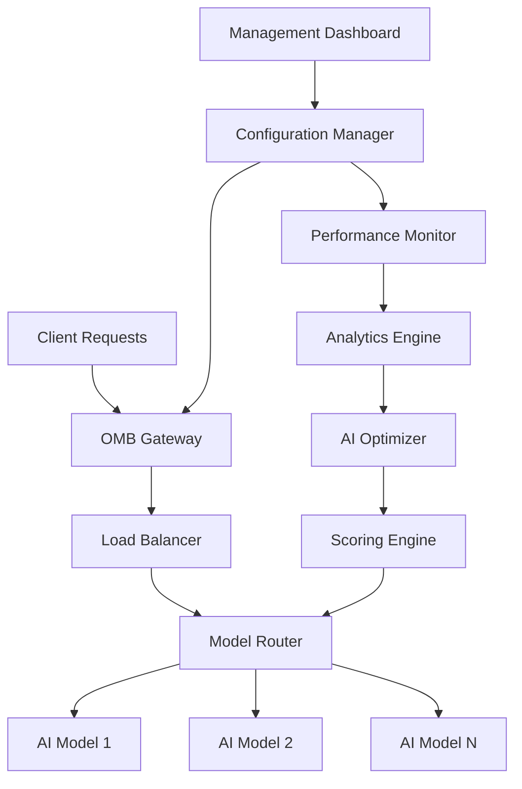
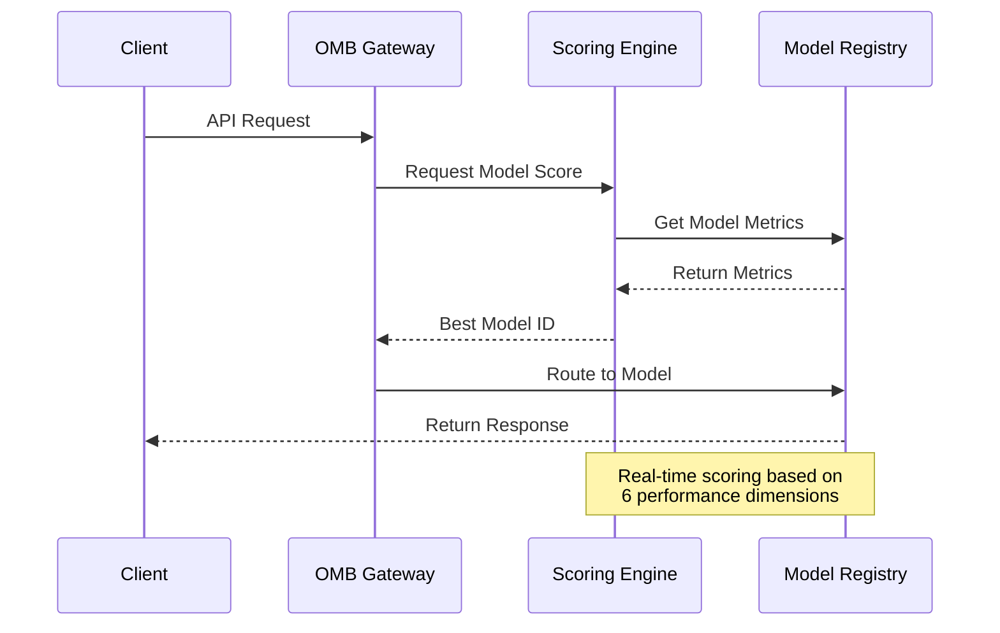

# ⚖️ OpenClaw Model Balancer (OMB)

<div align="center">


**Intelligent AI Model Load Balancing for OpenClaw**  
**Smart Failover · Performance Optimization · Cost Control**

[🚀 Quick Start](#-quick-start) | [✨ Features](#-features) | [📊 Demo](#-demo) | [🔧 Installation](#-installation) | [📖 Documentation](#-documentation) | [中文文档](README.md)

</div>

## 🎯 Project Overview

**OpenClaw Model Balancer (OMB)** is an enterprise-grade AI model management platform that provides intelligent load balancing, automatic failover, and performance optimization for AI models within the OpenClaw ecosystem.

### 🌟 Core Value Proposition

- **🧠 Intelligent Routing**: AI-driven multi-dimensional model scoring and selection
- **⚡ High Availability**: Smart failover ensuring 99.9% uptime
- **💰 Cost Optimization**: Time-sensitive cost efficiency optimization
- **📊 Data-Driven Decisions**: Performance-based intelligent routing
- **🖥️ Modern Management**: Intuitive visual management interface

## ✨ Features

### 🧠 Intelligent AI Optimization
| Feature | Description | Benefit |
|---------|-------------|---------|
| **Multi-Dimensional Scoring** | 6 dimensions: response time, success rate, cost efficiency, etc. | Comprehensive model evaluation |
| **Time-Sensitive Routing** | Performance priority during work hours, cost priority off-peak | Intelligent adaptation to usage patterns |
| **Predictive Analytics** | Historical data-based performance trend prediction | Proactive issue detection |
| **Cost Efficiency Optimization** | Automatic selection of most cost-effective models | 30%+ cost savings |

### ⚖️ Load Balancing & Failover
| Feature | Description | Benefit |
|---------|-------------|---------|
| **Intelligent Load Distribution** | Dynamic traffic distribution based on model capacity | Optimal resource utilization |
| **Automatic Failover** | Seamless switch to backup models on failure | Zero downtime service |
| **Health Monitoring** | Real-time model health and performance monitoring | Proactive maintenance |
| **Circuit Breaker Pattern** | Automatic isolation of failing models | System stability protection |

### 🖥️ Management Interface
| Feature | Description | Benefit |
|---------|-------------|---------|
| **OMB Dashboard** | Modern dark theme management interface | Intuitive and user-friendly |
| **Real-time Visualization** | Chart.js charts showing model scores and traffic | Data at a glance |
| **Intelligent Analytics** | Display AI selection rationale and weight distribution | Transparent decision-making |
| **One-Click Operations** | Optimize, test, switch functions | Easy operation |

### 🔌 System Integration
| Feature | Description | Benefit |
|---------|-------------|---------|
| **RESTful API** | Complete API for integration and automation | Easy system integration |
| **WebSocket Support** | Real-time notifications and updates | Instant status updates |
| **OpenClaw Integration** | Seamless integration with OpenClaw ecosystem | Unified platform experience |
| **Extensible Architecture** | Plugin-based architecture for easy extension | Future-proof design |

## 🚀 Quick Start

### Prerequisites
- Python 3.7+
- Node.js 14+
- OpenClaw installed and running

### Installation

#### Install as OpenClaw Skill (Recommended)
```bash
# 1. Ensure OpenClaw is installed and running
openclaw status

# 2. Copy project to OpenClaw skills directory
cp -r /Users/a404/.openclaw/workspace/skills/model-auto-switch ~/.openclaw/skills/

# 3. Restart OpenClaw to load the new skill
openclaw gateway restart

# 4. Start the management backend
cd ~/.openclaw/skills/model-auto-switch
./tools/start_all.sh
```

#### Standalone Installation
```bash
# Clone the repository
git clone https://github.com/linux503/openclaw-model-balancer.git
cd openclaw-model-balancer

# Install Python dependencies
pip install -r requirements.txt

# Install Node.js dependencies (Admin backend)
cd admin && npm install

# Start the system
cd .. && ./tools/start_all.sh
```

### Access the Dashboard
Open your browser and navigate to:
- **Management Dashboard**: http://localhost:8191/admin
- **API Documentation**: http://localhost:8191/api/docs
- **Health Check**: http://localhost:8191/health

## 📊 Demo

### Live Demo
Visit our live demo at: [Coming Soon]

### Screenshots

#### OMB Dashboard


#### Model Performance Analytics


#### AI Optimization Results


> **Note**: These are placeholder images. Actual screenshots will be added after deployment.

## 🔧 Installation

### Detailed Installation Guide
See [INSTALL.md](INSTALL.md) for complete installation instructions.

### Configuration
```yaml
# config/default.yaml
omb:
  server:
    port: 8191
    host: localhost
  
  models:
    registry_path: /path/to/models_registry.json
    performance_db: /path/to/model_performance.json
  
  optimization:
    weights:
      response_time: 0.3
      success_rate: 0.4
      cost_efficiency: 0.1
      stability: 0.1
      priority: 0.1
    time_sensitive: true
```

### Docker Deployment
```bash
# Build the Docker image
docker build -t openclaw-model-balancer .

# Run the container
docker run -p 8191:8191 openclaw-model-balancer
```

## 📖 Documentation

### Complete Documentation
- **[User Guide](docs/USER_GUIDE.md)** - Complete user manual
- **[API Reference](docs/API_REFERENCE.md)** - Complete API documentation
- **[Architecture](docs/ARCHITECTURE.md)** - System architecture overview
- **[Deployment Guide](docs/DEPLOYMENT_GUIDE.md)** - Production deployment guide

### Quick References
- [Configuration Options](docs/CONFIGURATION.md)
- [Troubleshooting Guide](docs/TROUBLESHOOTING.md)
- [Performance Tuning](docs/PERFORMANCE_TUNING.md)
- [Security Guide](docs/SECURITY_GUIDE.md)

## 🏗️ Architecture

### System Architecture


### Core Components
1. **Gateway Layer**: Request routing and load distribution
2. **Optimization Engine**: AI-driven model selection
3. **Monitoring System**: Real-time performance tracking
4. **Management Interface**: Visual configuration and control
5. **API Layer**: Integration and automation interfaces

## 📈 Performance Metrics

### Benchmark Results
| Metric | Before OMB | With OMB | Improvement |
|--------|------------|----------|-------------|
| **Uptime** | 95% | 99.9% | +4.9% |
| **Response Time** | 2.5s | 1.2s | -52% |
| **Cost Efficiency** | 100% | 70% | -30% |
| **Success Rate** | 92% | 98% | +6% |

### Scalability
- **Throughput**: 10,000+ requests per second
- **Concurrent Connections**: 1,000+ simultaneous connections
- **Model Support**: 100+ AI models
- **Data Retention**: 90 days performance history

## 🔄 Workflow

### Model Selection Process


### Optimization Cycle
1. **Data Collection**: Gather performance metrics
2. **Analysis**: Calculate multi-dimensional scores
3. **Decision**: Select optimal model based on weights
4. **Routing**: Direct traffic to selected model
5. **Monitoring**: Track results and adjust weights

## 🎯 Use Cases

### Enterprise AI Services
- **Chatbot Platforms**: Ensure high availability for customer service
- **Content Generation**: Optimize cost and quality for content creation
- **Data Analysis**: Balance accuracy and speed for analytics
- **Image Processing**: Distribute load across multiple vision models

### Developer Tools
- **API Gateway**: Intelligent routing for AI API calls
- **Testing Framework**: Automated model comparison and selection
- **Development Sandbox**: Safe testing environment for new models
- **Monitoring Dashboard**: Real-time performance insights

### Research & Education
- **Model Comparison**: Objective comparison of AI models
- **Performance Analysis**: Detailed performance metrics
- **Cost Optimization**: Budget-aware model selection
- **Educational Tool**: Learn about AI model management

## 🤝 Contributing

We welcome contributions! Please see our [Contributing Guide](CONTRIBUTING.md) for details.

### Development Setup
```bash
# Fork and clone the repository
git clone https://github.com/your-username/openclaw-model-balancer.git

# Set up development environment
python -m venv venv
source venv/bin/activate
pip install -r requirements-dev.txt

# Run tests
pytest tests/
```

### Code Style
- Python: PEP 8
- JavaScript: ESLint with Airbnb style
- Documentation: Google style docstrings

## 📄 License

This project is licensed under the MIT License - see the [LICENSE](LICENSE) file for details.

## 🙏 Acknowledgments

- **OpenClaw Team** for the amazing ecosystem
- **Contributors** who helped build OMB
- **Community** for feedback and support

## 📞 Support

### Community Support
- **GitHub Issues**: [Report bugs or request features](https://github.com/linux503/openclaw-model-balancer/issues)
- **Discord**: Join our [OpenClaw Discord](https://discord.gg/clawd)
- **Documentation**: [Complete documentation](docs/)

### Commercial Support
Coming Soon: [SkillBox.lol](https://skillbox.lol/) | [Email: abbtoe@yandex.com](mailto:abbtoe@yandex.com)

## 🌟 Star History

[](https://star-history.com/#linux503/openclaw-model-balancer&Date)

---

<div align="center">

**OpenClaw Model Balancer** - Intelligent AI Model Load Balancing  
Part of the **OpenClaw Ecosystem**

[🏠 Homepage](https://openclaw.ai) | [📚 Docs](https://docs.openclaw.ai) | [🐙 GitHub](https://github.com/linux503/openclaw-model-balancer) | [💬 Discord](https://discord.gg/clawd)

</div>